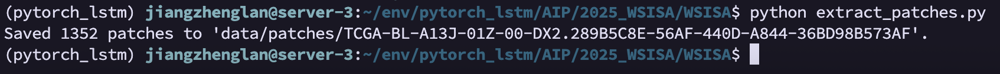
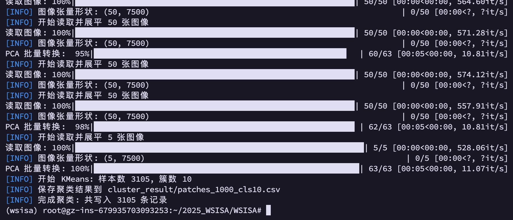
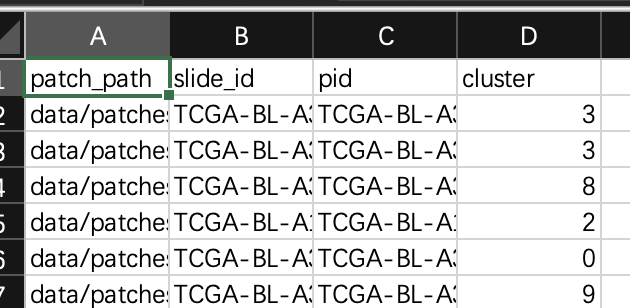
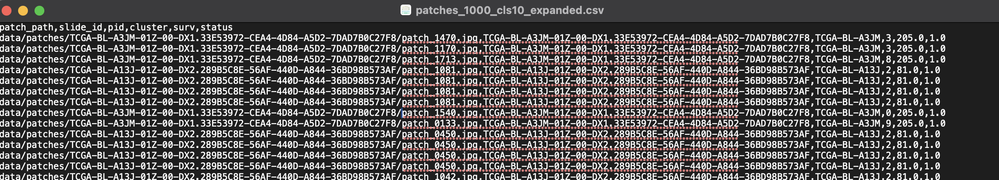
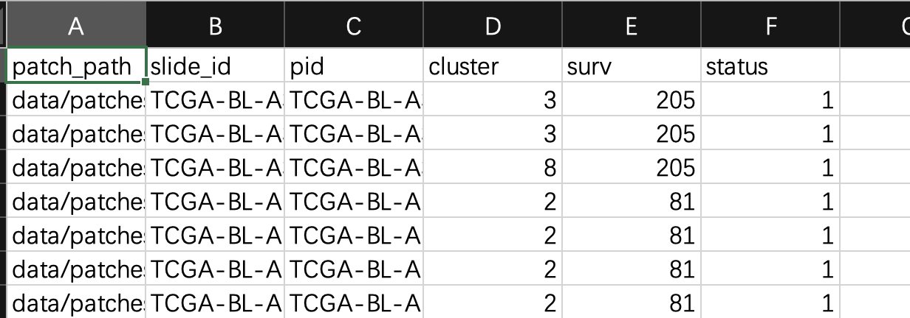

# WSISA

## 代码结构

```bash
WSISA/
├── extract_patches.py             # (可选) 从 WSI 中提取图像块
├── pca_cluster_img.py             # 第一步：对所有图像块进行 PCA + 聚类
├── WSISA_dataloader.py            # 数据加载器，供后续训练与推理使用
├── WSISA_utils.py                 # 公用工具函数（如图像预处理、度量计算等）
├── networks.py                    # 定义网络结构（DeepConvSurv/PyTorch 版本）
├── main_WSISA_selectedCluster.py  # 第三步：集成已选簇进行特征提取与生存模型训练
├── expand_cluster_labels.py
├── deep_networks.py                 # DeepConvSurv 网络定义
├── cluster_select_deepconvsurv.py   # 深度模型训练/验证
脚本
├── data/
│   ├── WSI/                      # 原始 WSI 图像文件
│   │   ├── WSI_001.svs
│   │   ├── WSI_002.svs
│   │   └── ...
│   ├── patches/                  # 提取的图像块
│   │   ├── WSI_001/
│   │   │   ├── patch_0001.png
│   │   │   └── patch_0002.png
│   │   └── WSI_002/
│   │       ├── patch_0001.png
│   │       └── patch_0002.png
│   └── patients.csv              # 病人相关标签信息
├── cluster_result/               # 聚类结果
│   ├── patches_1000_cls10.csv     # 聚类结果文件
│   └── patches_1000_cls10_expanded.csv # 扩展
├── log/                          # 日志文件
│   ├── log.txt                   # 训练日志
│   └── log_selected.txt          # 选簇日志
├── model/                        # 训练好的模型
│   ├── cluster_0.pth             # 第 0 簇模型
│   ├── cluster_1.pth             # 第 1 簇模型
│   ├── cluster_2.pth             # 第 2 簇模型
│   └── ...
│       └── cluster_n.pth         # 第 n 簇模型
└── README.md                      # 本文件
```

## 实验步骤
### 1. 得到 patches `extract_patches.py`
从 WSI 中提取图像块（patches），并保存到指定目录。

```bash
python extract_patches.py
```

注意一次只能处理一张WSI，没有实现批量处理。

运行前修改：
```python
# WSI 文件名（放在 data/WSI/ 目录下）
slide_name = "TCGA-BL-A13J-01Z-00-DX2.289B5C8E-56AF-440D-A844-36BD98B573AF.svs"

# 基于仓库根目录的相对路径
slide_path = os.path.join("data", "WSI", slide_name)

# 输出 patches 存放在 data/patches/<slide_basename>/
slide_basename = os.path.splitext(slide_name)[0]
save_dir = os.path.join("data", "patches", slide_basename)
```

时间较长，需要耐心等待。



### 2. PCA降维 + 聚类 `pca_cluster_img.py`
对所有提取好的 patches 进行 PCA 降维并 K-Means 聚类。
```bash
python pca_cluster_img.py
```

如有需要，根据需求安装下述环境：
```bash
# 安装 CPU 版本
conda install -c conda-forge faiss-cpu

# 如果你想用 GPU 版本（需要 CUDA），可以改成：
conda install -c conda-forge faiss-gpu

pip install faiss-cpu
```

1. 遍历 data/patches 下所有子文件夹（每个子文件夹对应一个 WSI），将所有子文件夹里 .png 补丁文件一次性收集到一个列表里；
2. 对这个列表中的所有补丁一并做 PCA 降维和 K-Means 聚类； 
3. 最终输出一个全局的聚类结果 CSV。

```csv
patch_path,slide_id,pid,cluster
data/patches/TCGA-BL-A3JM-01Z-00-DX1.../patch_0490.jpg,TCGA-BL-A3JM-01Z-00-DX1...,TCGA-BL-A3JM,6
data/patches/TCGA-BL-A3JM-01Z-00-DX1.../patch_1445.jpg,TCGA-BL-A3JM-01Z-00-DX1...,TCGA-BL-A3JM,3
...
```
表示这是 WSI “WSI_002” 里第 456 张 patch；在全局聚类（对所有 patch 做 PCA + KMeans）里，它被分到了第 3 号簇。

你可以按 cluster_label 分组，查看每个簇里有哪些 patch；也可以按 slide_id 分组，查看同一张切片在不同簇中的 patch 分布。

运行结果如下：


检查聚类结果，存在文件 `cluster_result/patches_1000_cls10.csv`，包含了每个 patch 的聚类结果。

```csv
patch_path, slide_id, pid, cluster
data/patches/TCGA-BL-A3JM-01Z-00-DX1.../patch_0490.jpg, TCGA-BL-A3JM-01Z-00-DX1..., TCGA-BL-A3JM, 6
```



### 3. 簇选择 (Select Clusters) `main_WSISA_selectedCluster.py`
使用 DeepConvSurv 在每个簇内独立训练生存模型，并根据验证集表现选择最佳簇。

#### 3.1 标签扩展 `expand_cluster_labels.py`
我们需要patients.csv和cluster_result/patches_1000_cls10.csv两个文件来扩展标签。
1. `patients.csv` 文件包含了每个病人的生存时间和状态信息。
2. `cluster_result/patches_1000_cls10.csv` 文件包含了每个 patch 的聚类结果。

输出文件 `cluster_result/patches_1000_cls10_expanded.csv` 示例：
```csv
patch_path, slide_id, pid, cluster, surv, status
data/patches/TCGA-BL-A3JM-01Z-…/patch_0490.jpg, TCGA-BL-A3JM-01Z-00-DX1…, TCGA-BL-A3JM, 6, 562, 0
```





### 4. 集成与模型训练 (Integration & Training)
将选中的簇整合，提取对应 patch 的特征并进行最终生存模型训练。

### 生存预测 (Survival Prediction)


## 原始仓库README
Implementation of WSISA CVPR 2017
Implemented 4 step:
1. Clustering
``` 
python pca_cluster_img.py
```
Required modification before running the code:
```
data_dir = 'Paht/to/patches' # contains patches for all WSIs (eg 1000pathces/WSI)
```
2. Select clusters

deepConvSurv https://github.com/chunyuan1/deepConvSurv_PyTorch

3. Integration
``` 
python -u main_WSISA_selectedCluster.py | tee -a /path/to/save/log.txt
```
Required modification before running the code:
```
# in file main_WSISA_selectedCluster
selected_cluster = [0, 1, 5]  # contains cluster ID of selected cluster
img_path='path/to/all/patches'
label_path = 'path/to/label/file' # the label file should contains surv and status of each WSI
expand_label_path = 'path/to/extend/label/file'  # the expand label file contains cluster id for each patches
base_path = 'patch/to/trained/model/of/each/cluster'  # trained model in step 2
```
4. Survival prediction

code https://github.com/chunyuan1/WSISA_surv
