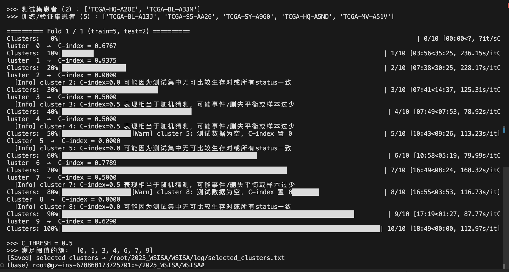
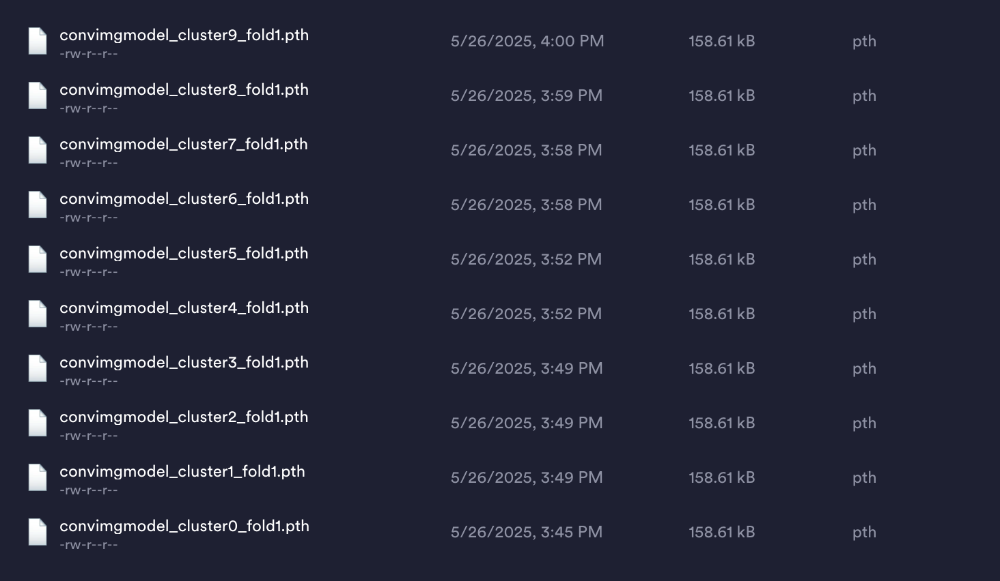
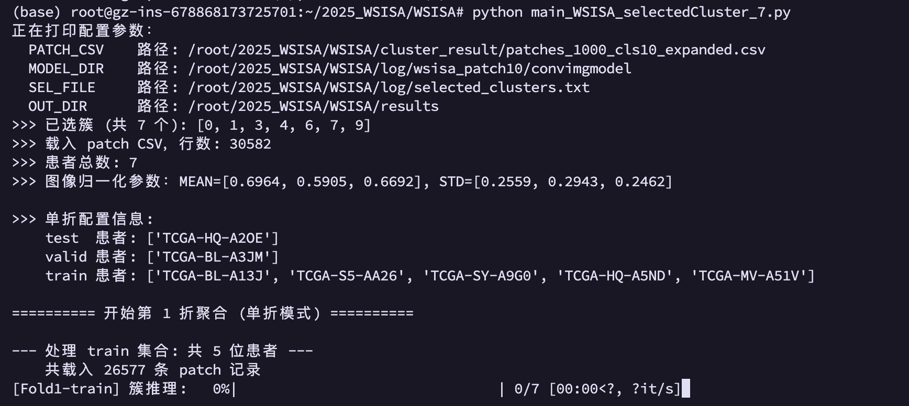
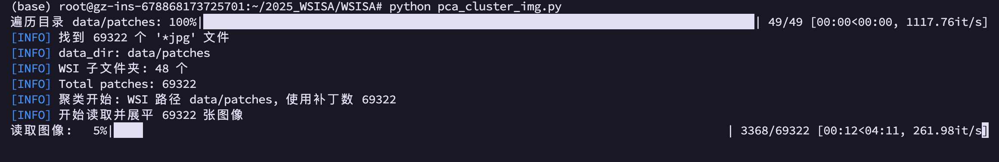
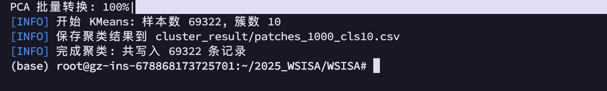
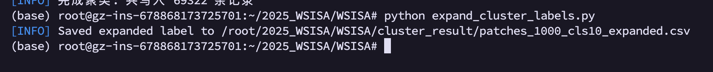

# WSISA

## 代码结构

```bash
WSISA/
├── extract_patches.py             # 从 WSI 中提取图像块
├── pca_cluster_img.py             # 第一步：对所有图像块进行 PCA + 聚类
├── WSISA_dataloader.py            # 数据加载器，供后续训练与推理使用
├── WSISA_utils.py                 # 公用工具函数（如图像预处理、度量计算等）
├── expand_cluster_labels.py
├── networks.py
├── cluster_select_deepconvsurv_7.py   # 深度模型训练/验证
├── cluster_select_deepconvsurv.py   # 深度模型训练/验证
├── main_WSISA_selectedCluster_7.py  # 第三步：集成已选簇进行特征提取与生存模型训练，针对7个患者的情况
├── main_WSISA_selectedCluster.py  # 第三步：集成已选簇进行特征提取与生存模型训练
├── data/
│   ├── WSI_7/                      # 原始 WSI 图像文件
│   │   ├── WSI_001.svs
│   │   ├── WSI_002.svs
│   │   └── ...
│   ├── WSI_40/                        # 原始 WSI 图像文件
│   │   ├── WSI_001
│   │   │   ├── WSI_001.svs
│   │   ├── WSI_002
│   │   │   ├── WSI_002.svs
│   │   └── ...
│   ├── patches_7/                  # 提取的图像块
│   │   ├── WSI_001/
│   │   │   ├── patch_0001.png
│   │   │   └── patch_0002.png
│   │   └── WSI_002/
│   │       ├── patch_0001.png
│   │       └── patch_0002.png
│   └── patches_40/                 # 提取的图像块
│       ├── WSI_001/
│       │   ├── patch_0001.png
│       │   └── patch_0002.png
│       ├── WSI_002/
│       │   ├── patch_0001.png
│       │   └── patch_0002.png
│       └── ...
│   └── patients.csv              # 病人相关标签信息
├── cluster_result/               # 聚类结果
│   ├── patches_1000_cls10.csv     # 聚类结果文件
│   └── patches_1000_cls10_expanded.csv # 扩展
├── log/                          # 日志文件
│   ├── log.txt                   # 训练日志
│   └── log_selected.txt          # 选簇日志
├── model/                        # 训练好的模型
│   ├── cluster_0.pth             # 第 0 簇模型
│   ├── cluster_1.pth             # 第 1 簇模型
│   ├── cluster_2.pth             # 第 2 簇模型
│   └── ...
│       └── cluster_n.pth         # 第 n 簇模型
└── README.md                      # 本文件
```

## 实验步骤
### 1. 得到 patches `extract_patches.py`
从 WSI 中提取图像块（patches），并保存到指定目录。

```bash
python extract_patches.py
```

运行前修改：
```python
# WSI 文件名（放在 data/WSI/ 目录下）
slide_name = "TCGA-BL-A13J-01Z-00-DX2.289B5C8E-56AF-440D-A844-36BD98B573AF.svs"

# 基于仓库根目录的相对路径
slide_path = os.path.join("data", "WSI", slide_name)

# 输出 patches 存放在 data/patches/<slide_basename>/
slide_basename = os.path.splitext(slide_name)[0]
save_dir = os.path.join("data", "patches", slide_basename)
```

时间较长，需要耐心等待。我们一共处理7张WSI文件。

### 2. PCA降维 + 聚类 `pca_cluster_img.py`

对所有提取好的 patches 进行 PCA 降维并 K-Means 聚类。

```bash
python pca_cluster_img.py
```

如有需要，根据需求安装下述环境：
```bash
# 安装 CPU 版本
conda install -c conda-forge faiss-cpu

# 如果你想用 GPU 版本（需要 CUDA），可以改成：
conda install -c conda-forge faiss-gpu

pip install faiss-cpu
```

1. **初始化**：遍历 data/patches 下所有子文件夹（每个子文件夹对应一个 WSI），将所有子文件夹里 .png 补丁文件一次性收集到一个列表里；
2. **对这个列表中的所有补丁一并做 PCA 降维和 K-Means 聚类**：将这些补丁图像patches缩放、展平成向量后，用增量PCA将维度从（50×50×3≈7500）降到 n_comp（这里固定为 50）。再用 KMeans 将所有补丁分成 num_clusters 个簇；
3. **输出**：最终会在 cluster_result/ 目录里生成一个名为命名为 `patches_1000_cls10.csv`，实际是包含了每个补丁的路径、WSI ID、患者 ID 和聚类簇 

#### 2.1 PCA降维

##### 增量 PCA 的训练
一个 batch 就是最多 100 个 patch，更新它的主成分。在数据量很大、一次性载入内存会溢出的情况下，分小批（batch）读入数据，逐步更新对主成分（eigenvectors）的估计。

##### PCA 批量转换
这里一个 batch 是 50 张 patch，它们先被读入、展平，然后一次性做 pca.transform(...)，把降维后的结果写进 points 数组中。

#### 2.2 K-Means聚类和输出

输出命名为：注意每个子文件夹（每 个 WSI）随机抽样最多 1000 张补丁时所用的那个阈值为 `num_file`，聚类数为 `num_clusters`。
```bash
patches_<num_file>_cls<num_clusters>.csv
```

输出文件 `cluster_result/patches_1000_cls10.csv` 示例：
```csv
patch_path,slide_id,pid,cluster
data/patches/TCGA-BL-A3JM-01Z-00-DX1.../patch_0490.jpg,TCGA-BL-A3JM-01Z-00-DX1...,TCGA-BL-A3JM,6
data/patches/TCGA-BL-A3JM-01Z-00-DX1.../patch_1445.jpg,TCGA-BL-A3JM-01Z-00-DX1...,TCGA-BL-A3JM,3
...
```
表示这是 WSI “WSI_002” 里第 456 张 patch；在全局聚类（对所有 patch 做 PCA + KMeans）里，它被分到了第 3 号簇。

你可以按 cluster_label 分组，查看每个簇里有哪些 patch；也可以按 slide_id 分组，查看同一张切片在不同簇中的 patch 分布。

运行结果如下：
```bash
(base) root@gz-ins-678868173725701:~/WSISA# python pca_cluster_img.py                              
遍历目录 data/patches: 100%|█████████████████████████████████████████████████| 8/8 [00:00<00:00, 459.12it/s]
[INFO] 找到 26526 个 '*jpg' 文件
[INFO] data_dir: data/patches
[INFO] WSI 子文件夹: 7 个
[INFO] Total patches: 26526
[INFO] 聚类开始: WSI 路径 data/patches, 使用补丁数 26526
[INFO] 开始读取并展平 26526 张图像
读取图像: 100%|██████████████████████████████████████████████████████| 26526/26526 [01:40<00:00, 263.94it/s]
[INFO] 图像张量形状: (26526, 7500)
[INFO] IncrementalPCA 开始, 组件数 50, 批大小 100

[INFO] 开始 KMeans: 样本数 26526, 簇数 10
[INFO] 保存聚类结果到 cluster_result/patches_1000_cls10.csv
[INFO] 完成聚类: 共写入 26526 条记录
```


检查聚类结果，存在文件 `cluster_result/patches_1000_cls10.csv`，包含了每个 patch 的聚类结果。

```csv
patch_path, slide_id, pid, cluster
data/patches/TCGA-BL-A3JM-01Z-00-DX1.../patch_0490.jpg, TCGA-BL-A3JM-01Z-00-DX1..., TCGA-BL-A3JM, 6
```


### 3. 簇选择 (Select Clusters)
使用 DeepConvSurv 在每个簇内独立训练生存模型，并根据验证集表现选择最佳簇。

#### 3.1 标签扩展 `expand_cluster_labels.py`
我们需要patients.csv和cluster_result/patches_1000_cls10.csv两个文件来扩展标签。
1. `patients.csv` 文件包含了每个病人的生存时间和状态信息。
2. `cluster_result/patches_1000_cls10.csv` 文件包含了每个 patch 的聚类结果。

对`patients.csv`处理如下：只保留了 barcode（样本条码）、vital_status（生还／死亡状态）、days_to_death（若死亡，距死亡的天数）和 days_to_last_follow_up（若存活，距最后一次随访的天数）这四列。
1. 以 barcode 按 - 分割，取前三段（例如 TCGA-BL-A3JM-... → TCGA-BL-A3JM），作为患者级别的 pid。
2. 将文本标签映射为数值：死亡（Dead）->1、存活（Alive）->0。
3. 计算生存时间则先把天数列转换为数值型，如果患者已亡（status==1），surv 取 days_to_death，从入组到死亡的天数；否则取 days_to_last_follow_up，到最后一次随访的天数/观测到的最大存活时间。


输出文件 `cluster_result/patches_1000_cls10_expanded.csv` 示例：
```csv
patch_path,slide_id,pid,cluster,surv,status
data/patches/TCGA-SY-A9G0-01Z-00-DX1.6F019857-03C8-4B2B-8892-32CBF3EB303F/patch_4633.jpg,TCGA-SY-A9G0-01Z-00-DX1.6F019857-03C8-4B2B-8892-32CBF3EB303F,TCGA-SY-A9G0,5,1008.0,1.0
data/patches/TCGA-S5-AA26-01Z-00-DX1.10D28D0C-D537-485E-A371-E3C60ED66FE7/patch_5949.jpg,TCGA-S5-AA26-01Z-00-DX1.10D28D0C-D537-485E-A371-E3C60ED66FE7,TCGA-S5-AA26,0,503.0,0.0
```


### 3.2 簇选择 `cluster_select_deepconvsurv_pytorch.py`

#### 3.2.1 原始代码五折划分
在原始这段脚本里，五折划分（5-fold）是一个“两层分层抽样”的过程，目的是：
1. **患者级别**：在患者（pid）级别上把所有患者分成 5 份，做 5 折交叉验证。每一次折里，算法会给出两组患者 ID：一组做训练，另一组做测试。“分层”保证每组中的 “有事件(1)” vs “无事件(0)” 患者比例和全体一致。在训练患者里再抽一小部分出来当验证集，剩下的继续当训练集。
2. **Patch级别**：上面那一步拿到的是 哪些患者该训练 / 验证 / 测试。进行筛选和转化后利用海量的 patch 样本来训练你的网络，同时在真正“没见过”的新患者身上评估模型。

循环 5 次，每折记录验证和测试的 C-index，最后汇总平均与标准差。

这样既保证了病人级互斥（测试时全是“没见过”的患者），又利用了补丁级样本数来训练深度网络。

#### 3.2.2 对原始代码进行改造 `cluster_select_deepconvsurv_7.py`
我们对原始代码进行了改造，主要是为了适应我们只有 7 个患者的情况。原始代码的五折交叉验证在这种情况下会报错。我们实现的功能是自动筛选出**对患者级风险预测最有贡献的簇集合**，去掉表现随机或更差的簇。

模型权重 已保存到 log/wsisa_patch10/convimgmodel，聚合脚本可按折（LOPO-7）加载对应簇模型，推理 patch → patient 级特征 & 风险。

首先打印了各簇的 patch 数量分布、总共涉及的患者数（7 位）、以及每位患者的 status（0/1）。

接着自动从 7 位患者中挑出一对既有死亡又有存活的（status 同时包含 0 和 1）作为 测试集，其余 5 位作为 训练/验证集。


```bash
>>> cluster 分布:
  cluster  0:   6593 patches
  cluster  1:   6423 patches
  cluster  2:     71 patches
  cluster  3:    336 patches
  cluster  4:   4593 patches
  cluster  5:    522 patches
  cluster  6:   8814 patches
  cluster  7:    183 patches
  cluster  8:    717 patches
  cluster  9:   2330 patches

>>> 数据集共有 7 位病人

>>> 各患者生存状态:
  TCGA-BL-A13J: [1.0]
  TCGA-BL-A3JM: [1.0]
  TCGA-HQ-A2OE: [0.0]
  TCGA-HQ-A5ND: [1.0]
  TCGA-MV-A51V: [0.0]
  TCGA-S5-AA26: [0.0]
  TCGA-SY-A9G0: [1.0]

>>> 测试集患者（2）：['TCGA-HQ-A2OE', 'TCGA-BL-A3JM']
>>> 训练/验证集患者（5）：['TCGA-BL-A13J', 'TCGA-S5-AA26', 'TCGA-SY-A9G0', 'TCGA-HQ-A5ND', 'TCGA-MV-A51V']
```

结果输出如下,可以看到其实最高的cindex可以达到0.9375，但是由于数据过少可能没有参考价值，后续我们还会引入40张WSI在服务器上进行训练。
```bash
>>> C_THRESH = 0.5
>>> 满足阈值的簇： [0, 1, 3, 4, 6, 7, 9]
[Saved] selected clusters → /root/2025_WSISA/WSISA/log/selected_clusters.txt
```




输出如下：



### 3.3 生存预测 (Survival Prediction)


#### 3.3.1 生成带权重的患者级特征（Generating Weighted Features）
对于每个被选中的聚类 j，统计每位患者 i 在该聚类中包含的切片数 $n_{ij}$ 以及该患者的总切片数 $n_i$。

计算聚类 j 对患者 i 的权重：

$w_{ij} = \frac{n_{ij}}{n_i},
\quad i=1,\dots,N,\; j=1,\dots,J$

#### 3.3.2 患者级预测模型训练（Aggregation）
对于患者 i 在聚类 j 中的每个切片patche k，DeepConvSurv 会输出一个特征向量（可以是最终的风险分数，也可以是倒数第二层 FC 层的输出）$x_{ijk}$。通过对这些特征向量取平均，并乘以权重，就得到聚类层面的患者特征：

$x_{ij}
= w_{ij} \cdot \frac{1}{K}\sum_{k=1}^{K} x_{ijk}$

其中 $K=n_{ij}$。这样，每位患者就被映射为一个维度为 J（被选聚类数目）的特征向量 $(x_{i1},x_{i2},\dots,x_{iJ})  $


每个补丁通过对应簇的 DeepConvSurv 模型，输出一个风险得分（或某一全连接层特征）记为 $x_{ijk}$，其中 $k=1,\dots,K$ 表示患者 i 在簇 j 中的第 k 个补丁。下面的$x_{ij}$表示了患者 i 的 加权特征向量，维度与选定的簇数 J 相同。

#### 3.3.3 流程
对每个患者 i、每个簇 j：
1. 统计该患者在簇 j 下的 patch 数 $n_{ij}$，除以总 patch 数得权重 $w_{ij}$。
2. 对该簇所有 patch 的特征向量求平均 $\frac1{n_{ij}}\sum_k x_{ijk}$。
3. 用 $w_{ij}$ 乘以该均值，得到聚类级别的加权特征 $\tilde x_{ij}$。
4. 把所有簇 j 的 $\tilde x_{ij}$ 串起来，拼成患者级特征向量（长度 = 簇数×32）。
5. 同样地，以风险分数代替特征，也能同步输出患者级风险。

#### 3.3.4 输出结果
打印内容如下：


下述供下游生存模型（LASSO-Cox、RSF 等）直接读取：
* **患者级特征**：`{split}_patient_features_fold{fold}.csv`。这些向量就是我们后面用来做生存分析的输入特征。例如，可以把它们丢给 LASSO-Cox、随机森林 Cox、BoostCI、MTLSA 等模型，去学习哪几个聚类（簇）中提取到的形态信息最能预测生存。
* **患者级风险**：`{split}_patient_risks_fold{fold}.csv`。DeepConvSurv 原本输出的 $\log$‐风险（log-hazard），我们在每个簇的 patch 上也可以直接取平均（或加权平均）来得到患者级的“风险分数”。

**风险分数**让你快速验证各簇模型的有效性（算 C-index）。

**特征向量**则是进一步的、可扩展的表示，用于构建更复杂的多种 Cox/机器学习生存模型，也便于可视化和特征选择。

### 4. 实现`40张WSI`的测试

```bash
(base) root@gz-ins-678868173725701:~/2025_WSISA/WSISA# python pca_cluster_img.py
遍历目录 data/patches: 100%|████████████████████████████████████████████████████████████████████████████████| 49/49 [00:00<00:00, 1117.76it/s]
[INFO] 找到 69322 个 '*jpg' 文件
[INFO] data_dir: data/patches
[INFO] WSI 子文件夹: 48 个
[INFO] Total patches: 69322
[INFO] 聚类开始: WSI 路径 data/patches, 使用补丁数 69322
[INFO] 开始读取并展平 69322 张图像
读取图像:  13%|███████████▉                                                                             | 9274/69322 [00:35<03:49, 261.93it/s]

...

[INFO] 开始 KMeans: 样本数 69322, 簇数 10
[INFO] 保存聚类结果到 cluster_result/patches_1000_cls10.csv
[INFO] 完成聚类: 共写入 69322 条记录
(base) root@gz-ins-678868173725701:~/2025_WSISA/WSISA# 

(base) root@gz-ins-678868173725701:~/2025_WSISA/WSISA# python expand_cluster_labels.py
[INFO] Saved expanded label to /root/2025_WSISA/WSISA/cluster_result/patches_1000_cls10_expanded.csv
```





## 原始仓库README
Implementation of WSISA CVPR 2017
Implemented 4 step:
1. Clustering
``` 
python pca_cluster_img.py
```
Required modification before running the code:
```
data_dir = 'Paht/to/patches' # contains patches for all WSIs (eg 1000pathces/WSI)
```
2. Select clusters

deepConvSurv https://github.com/chunyuan1/deepConvSurv_PyTorch

3. Integration
``` 
python -u main_WSISA_selectedCluster.py | tee -a /path/to/save/log.txt
```
Required modification before running the code:
```
# in file main_WSISA_selectedCluster
selected_cluster = [0, 1, 5]  # contains cluster ID of selected cluster
img_path='path/to/all/patches'
label_path = 'path/to/label/file' # the label file should contains surv and status of each WSI
expand_label_path = 'path/to/extend/label/file'  # the expand label file contains cluster id for each patches
base_path = 'patch/to/trained/model/of/each/cluster'  # trained model in step 2
```
4. Survival prediction

code https://github.com/chunyuan1/WSISA_surv
